# Block Processing Flow

This document describes the complete flow of block processing in Komodo Classic, from when a new block arrives in the system until it becomes part of the active chain.

## Overview

When a new block is received (either from the network or locally mined), it goes through several stages of validation and connection before becoming part of the active blockchain. The main entry point is `ProcessNewBlock()`, which orchestrates the entire process.

## High-Level Flow

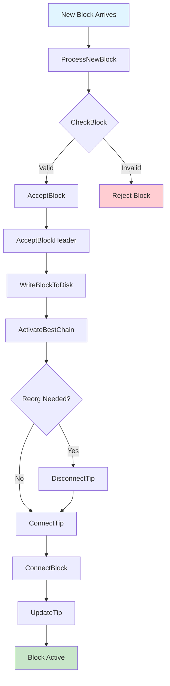

## Detailed Function Flow

### 1. ProcessNewBlock() - Entry Point

**Location:** `src/main.cpp:5756`

This is the main entry point for processing new blocks. It can be called from:
- Network peers (via `ProcessMessage()`)
- Local mining (`ProcessBlockFound()`)
- Block import/reindex operations

**Flow:**
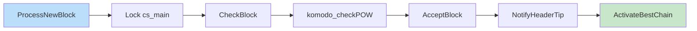

**Key Steps:**
1. **Preliminary Checks:**
   - Lock `cs_main` mutex
   - Update current height
   - Call `CheckBlock()` for initial validation
   - Check Proof of Work via `komodo_checkPOW()`

2. **Block Acceptance:**
   - Call `AcceptBlock()` to store the block
   - Track block source (which peer sent it)

3. **Chain Activation:**
   - Call `ActivateBestChain()` to make it part of the active chain
   - Notify UI about header tip

### 2. CheckBlock() - Initial Validation

**Location:** `src/main.cpp:5169`

Performs context-independent validation checks on the block.

**Checks Performed:**
- Block header validation (`CheckBlockHeader`)
- Proof of Work verification
- Merkle root validation
- Block size limits
- Coinbase transaction presence
- Transaction structure validation

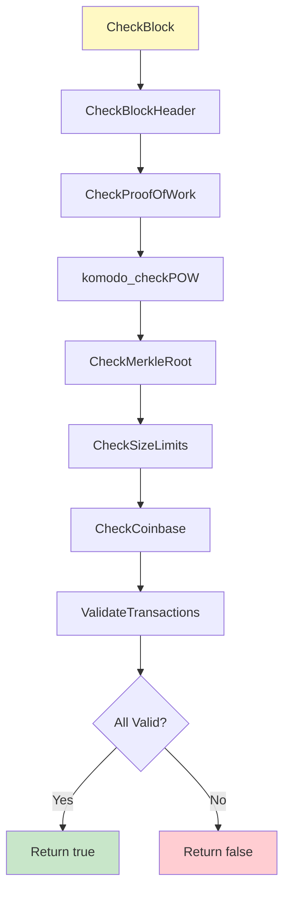

### 3. AcceptBlock() - Block Storage

**Location:** `src/main.cpp:5621`

Stores the block to disk and adds it to the block index. This function does NOT connect the block to the active chain yet.

**Flow:**
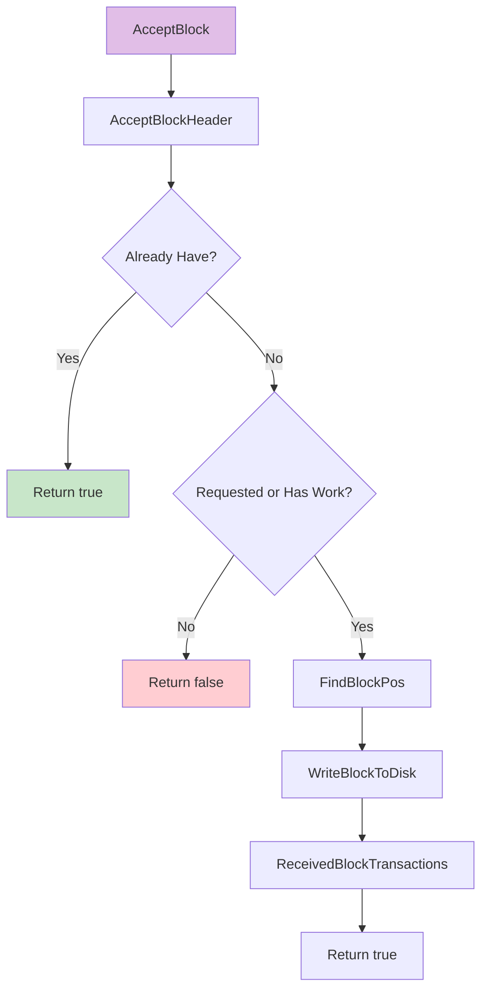

**Key Steps:**
1. **AcceptBlockHeader():**
   - Validates block header
   - Adds to block index (`mapBlockIndex`)
   - Checks for duplicates
   - Validates parent block exists

2. **WriteBlockToDisk():**
   - Finds position in block file
   - Writes block data to disk
   - Updates block index with file position

3. **ReceivedBlockTransactions():**
   - Updates transaction index
   - Marks block as having data (`BLOCK_HAVE_DATA`)

### 4. AcceptBlockHeader() - Header Validation

**Location:** `src/main.cpp:5517`

Validates and adds block header to the block index.

**Flow:**
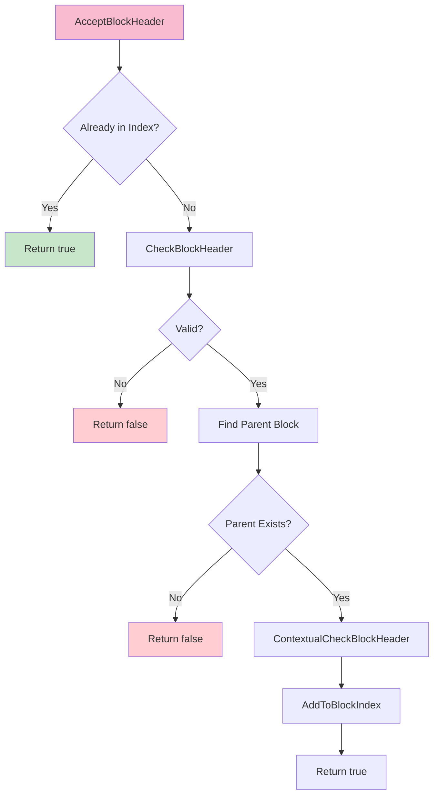

### 5. ActivateBestChain() - Chain Activation

**Location:** `src/main.cpp:4585`

This is the core function that activates the best chain. It finds the chain with the most work and connects blocks to make it active.

**Flow:**
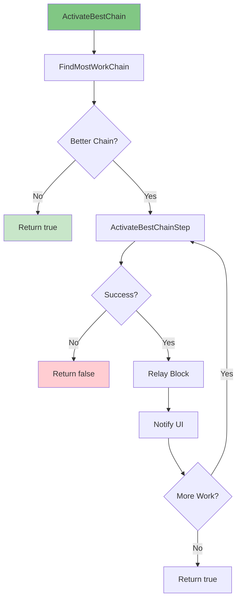

### 6. ActivateBestChainStep() - Single Step Activation

**Location:** `src/main.cpp:4398`

Performs a single step of chain activation. Handles chain reorganizations (reorgs) if needed.

**Flow:**
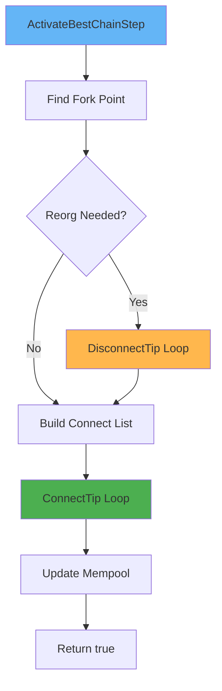

**Key Operations:**
1. **Find Fork Point:**
   - Determines where the new chain diverges from current chain
   - Checks reorg length limits

2. **DisconnectTip() (if reorg needed):**
   - Disconnects blocks from current tip back to fork point
   - Undoes transactions in UTXO set
   - Returns transactions to mempool

3. **ConnectTip() Loop:**
   - Connects each block from fork point to new tip
   - Processes up to 32 blocks at a time

### 7. ConnectTip() - Connect Block to Chain

**Location:** `src/main.cpp:4216`

Connects a single block to the active chain tip. This is where the block actually becomes part of the active chain.

**Flow:**
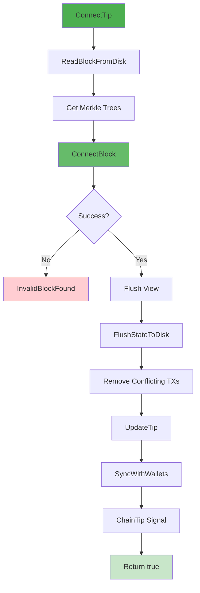

**Key Steps:**
1. **Read Block:**
   - Loads block from disk if not already in memory

2. **ConnectBlock():**
   - Applies block to UTXO set
   - Validates all transactions
   - Updates chain state

3. **Flush State:**
   - Saves UTXO set to disk
   - Updates chain state database

4. **Update Tip:**
   - Updates `chainActive` to point to new tip
   - Triggers notifications

5. **Mempool Updates:**
   - Removes conflicting transactions
   - Removes expired transactions

### 8. ConnectBlock() - Apply Block to UTXO Set

**Location:** `src/main.cpp:3314`

This is the most critical function - it applies the block's transactions to the UTXO (Unspent Transaction Output) set.

**Flow:**
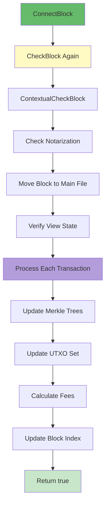

**Key Operations:**
1. **Re-validation:**
   - Calls `CheckBlock()` again with strict verifier
   - Performs `ContextualCheckBlock()` for context-dependent checks

2. **Notarization Check (Komodo-specific):**
   - Validates notarization transaction if present
   - Checks notary payments

3. **Transaction Processing:**
   - For each transaction in block:
     - Validates inputs exist in UTXO set
     - Checks script signatures
     - Updates UTXO set (spend inputs, add outputs)
     - Updates Merkle trees (Sprout/Sapling)

4. **State Updates:**
   - Updates block index with final state
   - Calculates and validates fees
   - Updates supply deltas

## Complete Sequence Diagram

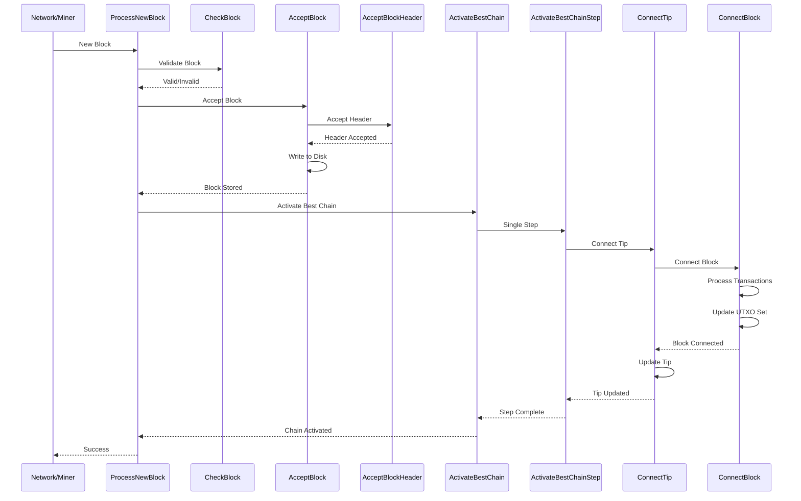

## Block Status Flags

During processing, blocks go through various status flags (defined in `src/chain.h`):

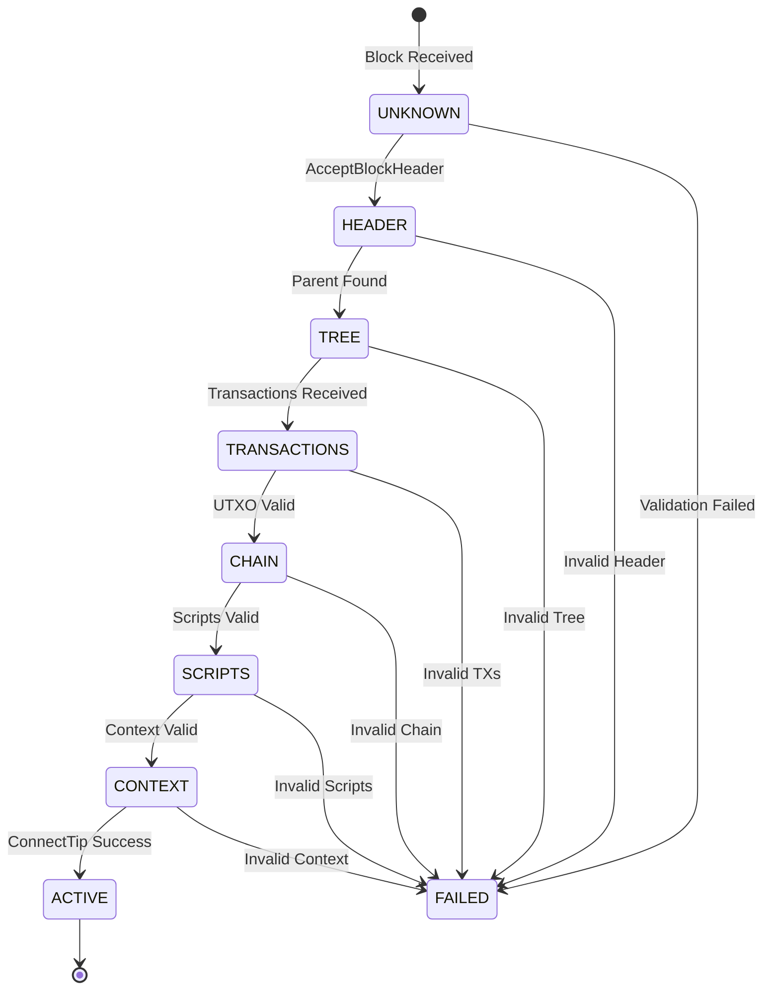

**Status Flags:**
- `BLOCK_VALID_HEADER` (1): Header validated
- `BLOCK_VALID_TREE` (2): Parent chain validated
- `BLOCK_VALID_TRANSACTIONS` (3): Transactions validated
- `BLOCK_VALID_CHAIN` (4): UTXO validation passed
- `BLOCK_VALID_SCRIPTS` (5): Script validation passed
- `BLOCK_VALID_CONTEXT` (6): Context checks passed
- `BLOCK_HAVE_DATA` (8): Block data on disk
- `BLOCK_FAILED_VALID` (32): Validation failed
- `BLOCK_FAILED_CHILD` (64): Child of failed block

## Error Handling

Blocks can be rejected at various stages:

1. **CheckBlock() failures:**
   - Invalid PoW
   - Invalid merkle root
   - Size violations
   - Invalid transaction structure

2. **AcceptBlock() failures:**
   - Duplicate block
   - Parent not found
   - Contextual validation failed

3. **ConnectBlock() failures:**
   - Double spend detected
   - Invalid script execution
   - UTXO inconsistencies
   - Notarization validation failed (Komodo-specific)

4. **ActivateBestChain() failures:**
   - Reorg too long
   - Chain work insufficient
   - System errors (disk space, etc.)

## Komodo-Specific Features

### Notarization Processing

Komodo blocks may contain notarization transactions:
- Notarization must be in transaction position 1
- Notaries must be paid in coinbase
- Validated in `ConnectBlock()` via `komodo_connectblock()`

### Future Blocks

The code handles "future blocks" (blocks with timestamps in the future):
- `futureblock` flag tracks this
- Future blocks are stored but not activated until their time arrives
- Checked in `CheckBlock()` and `AcceptBlock()`

### dPoW (delayed Proof of Work)

Komodo uses dPoW for additional security:
- Notarized height is checked during reorgs
- Prevents reorgs past notarized height
- Validated in `ActivateBestChainStep()`

## Performance Considerations

1. **Batch Processing:**
   - `ActivateBestChainStep()` processes up to 32 blocks at a time
   - Reduces lock contention

2. **Disk I/O:**
   - Blocks written to disk in `AcceptBlock()`
   - State flushed periodically, not after every block

3. **Validation Levels:**
   - Expensive checks can be skipped for checkpointed blocks
   - Script verification can be parallelized

4. **Mempool Management:**
   - Conflicting transactions removed after block connection
   - Expired transactions cleaned up

## Thread Safety

- All block processing happens under `cs_main` lock
- Network messages processed in message handling thread
- UI notifications sent without lock held
- Wallet sync happens after lock release

## Related Functions

- `DisconnectTip()`: Undoes a block from the active chain
- `UpdateTip()`: Updates chainActive and triggers notifications
- `InvalidBlockFound()`: Marks a block as invalid
- `InvalidChainFound()`: Marks a chain as invalid
- `FindMostWorkChain()`: Finds the chain with most cumulative work

## Summary

The block processing flow in Komodo Classic follows this sequence:

1. **Receive** → Block arrives via network or mining
2. **Validate** → `CheckBlock()` performs initial validation
3. **Store** → `AcceptBlock()` stores block to disk
4. **Activate** → `ActivateBestChain()` finds best chain
5. **Connect** → `ConnectTip()` → `ConnectBlock()` applies to UTXO set
6. **Update** → Chain tip updated, notifications sent

Each stage has specific validation checks and error handling to ensure only valid blocks become part of the active chain.
