# Transaction Signature Verification

This document provides a detailed explanation of how transaction signature verification is performed in Komodo Classic, with a focus on the validation process within `CheckBlock()` and `ValidateTransactions()`.

## Overview

Transaction signature verification is a critical security mechanism that ensures only the rightful owner of funds can spend them. In Komodo Classic, signature verification happens at multiple stages:

1. **CheckBlock()** - Initial transaction structure validation
2. **CheckTransaction()** - Basic transaction checks
3. **ContextualCheckTransaction()** - Context-dependent validation
4. **ConnectBlock()** - Full signature verification when connecting blocks

## High-Level Flow

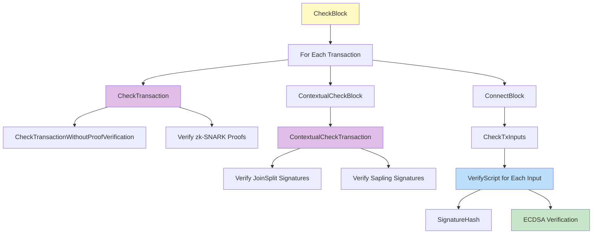

## Detailed Verification Flow

### 1. CheckBlock() - Transaction Validation Entry Point

**Location:** `src/main.cpp:5169`

Within `CheckBlock()`, transactions are validated in a loop:

```cpp
for (uint32_t i = 0; i < block.vtx.size(); i++)
{
    const CTransaction& tx = block.vtx[i];
    if (!CheckTransaction(tiptime,tx, state, verifier, i, (int32_t)block.vtx.size()))
        return error("CheckBlock: CheckTransaction failed");
}
```

**Flow:**
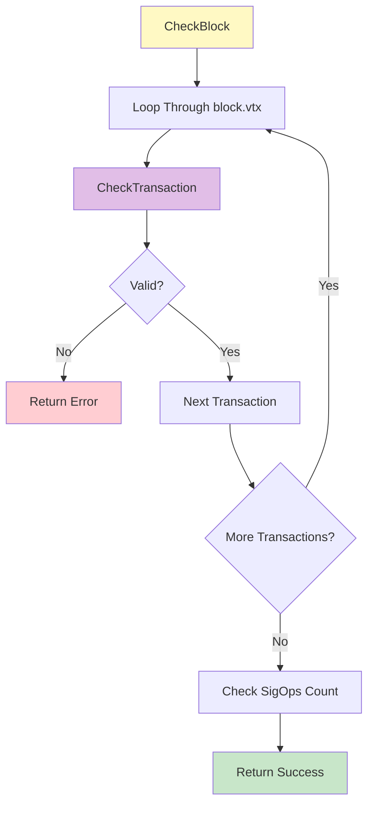

### 2. CheckTransaction() - Basic Transaction Validation

**Location:** `src/main.cpp:1378`

This function performs basic transaction structure validation:

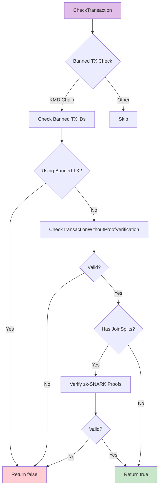

**Key Checks:**
- Banned transaction validation (KMD-specific)
- Staking transaction validation
- Basic transaction structure via `CheckTransactionWithoutProofVerification()`
- zk-SNARK proof verification for JoinSplits

### 3. ContextualCheckTransaction() - Context-Dependent Validation

**Location:** `src/main.cpp:1150`

This function performs context-dependent checks including signature verification for shielded transactions:

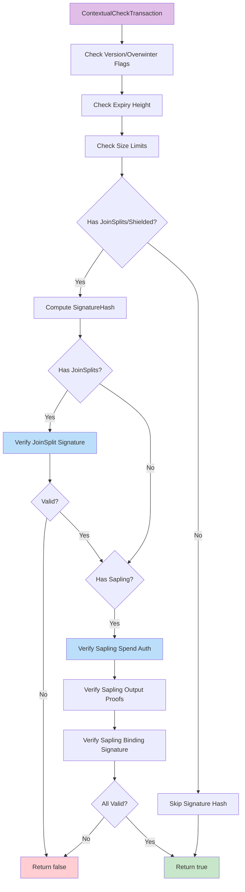

#### 3.1 JoinSplit Signature Verification

For transactions with JoinSplits, the signature is verified using libsodium:

```cpp
if (!(tx.IsMint() || tx.vjoinsplit.empty()))
{
    if (crypto_sign_verify_detached(&tx.joinSplitSig[0],
                                    dataToBeSigned.begin(), 32,
                                    tx.joinSplitPubKey.begin()) != 0) {
        return state.DoS(..., "bad-txns-invalid-joinsplit-signature");
    }
}
```

**Process:**
1. Compute `dataToBeSigned` using `SignatureHash()` with `NOT_AN_INPUT`
2. Verify detached signature using Ed25519 (libsodium)
3. Signature must match `joinSplitPubKey`

#### 3.2 Sapling Signature Verification

For Sapling transactions, multiple signature checks are performed:

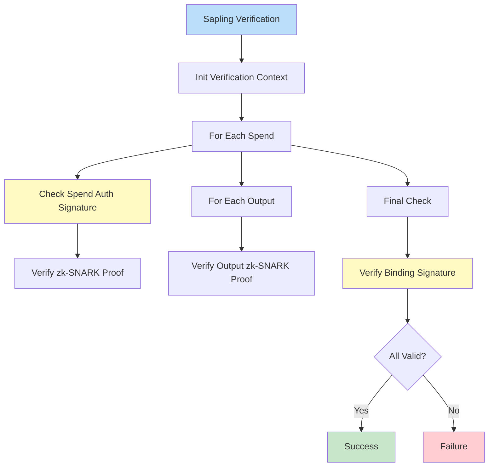

**Components:**
- **Spend Auth Signatures:** Each shielded spend includes an authentication signature
- **Output Proofs:** Each shielded output includes a zk-SNARK proof
- **Binding Signature:** A single signature that binds all shielded inputs/outputs

### 4. ConnectBlock() - Full Signature Verification

**Location:** `src/main.cpp:3314`

When connecting a block to the chain, full ECDSA signature verification is performed for transparent transactions:

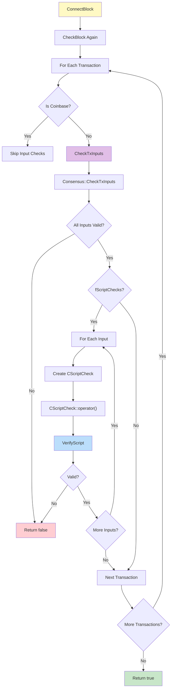

### 5. CScriptCheck - Individual Input Verification

**Location:** `src/main.cpp:2716`

Each transparent transaction input is verified using `CScriptCheck`:

```cpp
bool CScriptCheck::operator()() {
    const CScript &scriptSig = ptxTo->vin[nIn].scriptSig;
    ServerTransactionSignatureChecker checker(ptxTo, nIn, amount, cacheStore, *txdata);
    if (!VerifyScript(scriptSig, scriptPubKey, nFlags, checker, consensusBranchId, &error)) {
        return ::error("CScriptCheck(): %s:%d VerifySignature failed: %s", ...);
    }
    return true;
}
```

**Flow:**
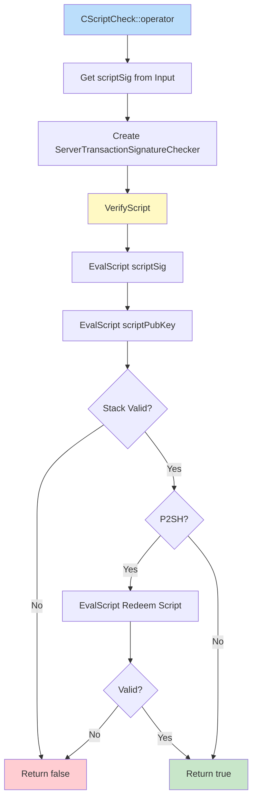

### 6. VerifyScript() - Script Execution

**Location:** `src/script/interpreter.cpp:1500`

This is the core function that executes Bitcoin script and verifies signatures:

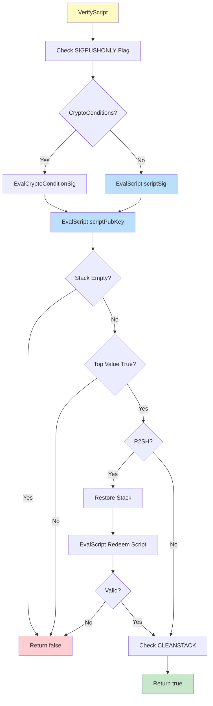

### 7. EvalScript() - Script Interpreter

**Location:** `src/script/interpreter.cpp:193`

The script interpreter executes opcodes. When it encounters `OP_CHECKSIG` or `OP_CHECKSIGVERIFY`, it calls the signature checker:

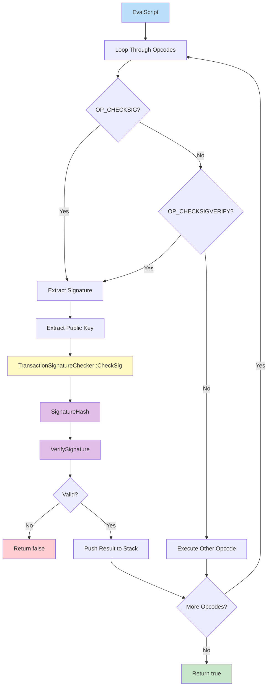

### 8. SignatureHash() - Computing the Hash to Sign

**Location:** `src/script/interpreter.cpp:1218`

This function computes the hash that will be signed. The process differs based on transaction version:

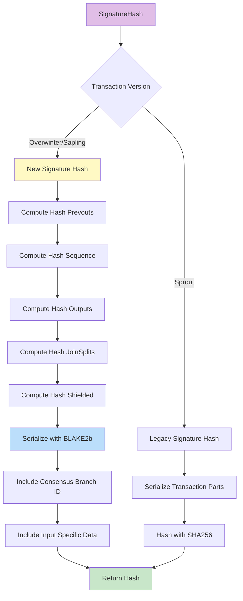

**Key Differences:**

1. **Sprout (Legacy):**
   - Uses SHA256
   - Serializes transaction parts based on `SIGHASH` flags
   - No consensus branch ID

2. **Overwinter/Sapling (New):**
   - Uses BLAKE2b with personalization
   - Includes consensus branch ID in personalization
   - Pre-computes hashes of prevouts, sequences, outputs
   - More efficient for transactions with many inputs/outputs

**Signature Hash Components (Overwinter/Sapling):**
- Transaction header (version, versionGroupId)
- Hash of all prevouts (unless SIGHASH_ANYONECANPAY)
- Hash of all sequences (unless SIGHASH_SINGLE/NONE)
- Hash of outputs (varies by SIGHASH type)
- Hash of JoinSplits
- Hash of shielded spends/outputs (Sapling only)
- Locktime
- Expiry height
- Value balance (Sapling only)
- Hash type
- Input-specific: prevout, scriptCode, amount, sequence

### 9. TransactionSignatureChecker::CheckSig() - ECDSA Verification

**Location:** `src/script/interpreter.cpp:1342`

This function performs the actual ECDSA signature verification:

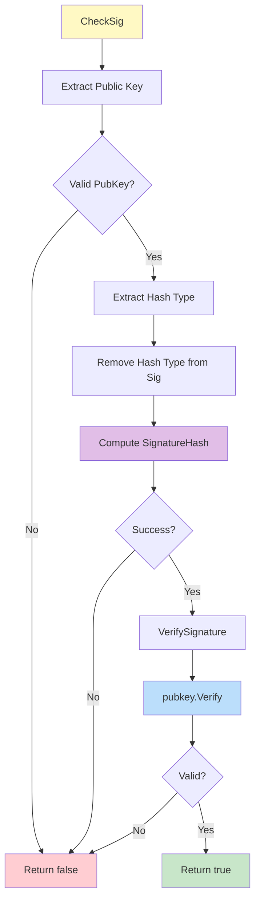

**Process:**
1. Extract and validate public key from script
2. Extract hash type (last byte of signature)
3. Compute `SignatureHash()` with the hash type
4. Call `pubkey.Verify(sighash, vchSig)` which uses secp256k1 ECDSA verification

### 10. CryptoConditions Support

Komodo Classic also supports CryptoConditions for advanced smart contracts:

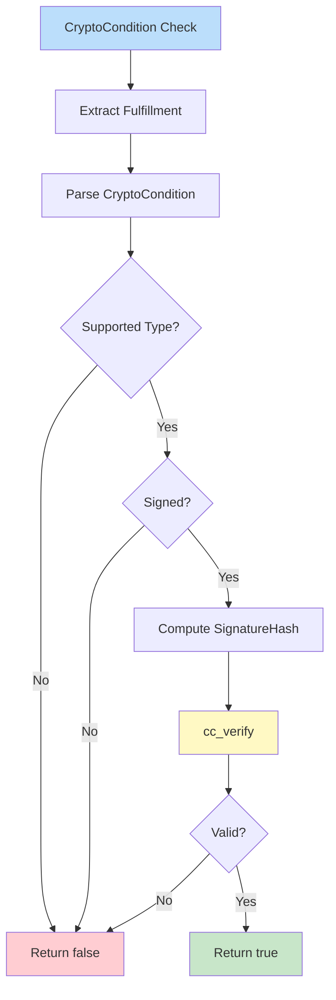

## Signature Verification Timing

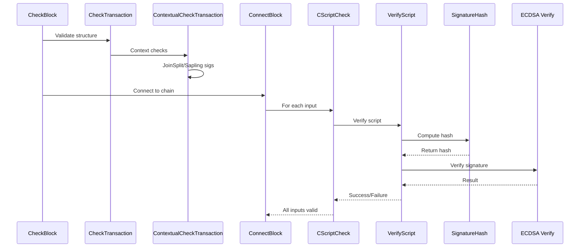

## Security Considerations

1. **CPU Exhaustion Protection:**
   - Expensive signature checks are deferred until after basic validation
   - All inputs must pass basic checks before signature verification begins

2. **Checkpoint Optimization:**
   - Blocks before the last checkpoint may skip signature verification
   - Merkle root validation still ensures integrity

3. **Signature Caching:**
   - Verified signatures can be cached to avoid redundant checks
   - Controlled by `cacheStore` parameter

4. **Script Flags:**
   - Various flags control script validation behavior
   - `STANDARD_SCRIPT_VERIFY_FLAGS` defines standard validation rules

## Code Locations Summary

| Component | File | Line Range |
|-----------|------|------------|
| CheckBlock | `src/main.cpp` | 5169-5360 |
| CheckTransaction | `src/main.cpp` | 1378-1437 |
| ContextualCheckTransaction | `src/main.cpp` | 1150-1376 |
| ConnectBlock | `src/main.cpp` | 3314-3500+ |
| CScriptCheck::operator() | `src/main.cpp` | 2716-2723 |
| VerifyScript | `src/script/interpreter.cpp` | 1500-1586 |
| EvalScript | `src/script/interpreter.cpp` | 193-1100+ |
| SignatureHash | `src/script/interpreter.cpp` | 1218-1334 |
| TransactionSignatureChecker::CheckSig | `src/script/interpreter.cpp` | 1342-1370 |
| VerifySignature | `src/script/interpreter.cpp` | 1336-1340 |

## Conclusion

Transaction signature verification in Komodo Classic is a multi-layered process that ensures:

1. **Structure Validation:** Basic transaction format is correct
2. **Context Validation:** Transaction is valid for the current block height
3. **Signature Verification:** All cryptographic signatures are valid
4. **Script Execution:** All script conditions are satisfied

The system supports multiple signature types:
- **ECDSA:** For transparent transactions (standard Bitcoin-style)
- **Ed25519:** For JoinSplit transactions (via libsodium)
- **Sapling Signatures:** For shielded transactions (zk-SNARK-based)
- **CryptoConditions:** For advanced smart contracts

Each signature type has its own verification path, but all ultimately ensure that only authorized parties can spend funds.
